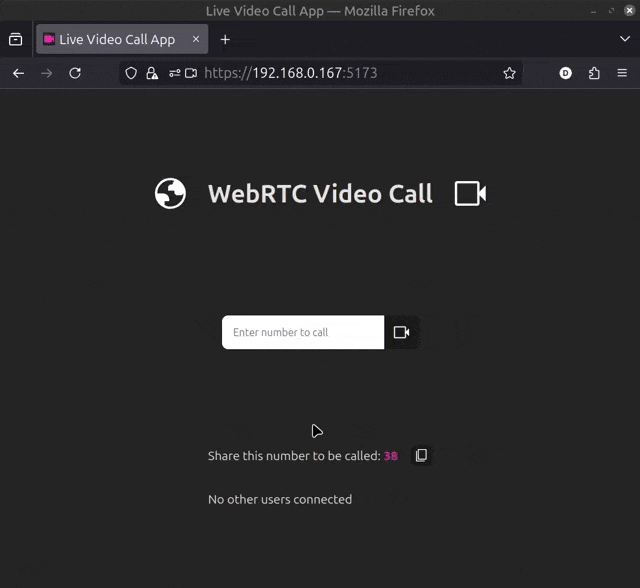
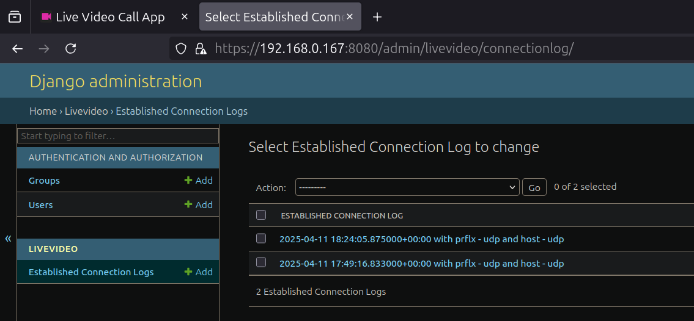

## Demo

Successful connections are logged in the SQL database accessible through the Django admin panel:

# How to use:
The docker-compose.yml is for development only. 
Only the django Dockerfile is needed to deploy on heroku.

- Use 'sudo make dev' in development.
- Use 'sudo make build_and_deploy' to build the react static files and deploy the production version of django to heroku
- For logs: 
sudo heroku logs --tail

# Deploying to Heroku as a single app:
- Django will serve the static React files after running `npm run build`.

### 1. From the root folder, create a Heroku app:
`heroku create live-video`

### 2. Place the Procfile in the backend folder alongside the Dockerfile
Procfile:

`web: gunicorn livevideo.asgi:application --worker-class uvicorn.workers.UvicornWorker --bind 0.0.0.0:$PORT`

### 3. From the backend folder, set the app's stack to container to use Docker:
`heroku stack:set container`
### Log in to Heroku Container Registry:
`sudo heroku container:login`
### 4. From the backend folder, push the container (builds an image and pushes it to Container Registry):
`sudo heroku container:push web -a live-video`
### 5. Release the container (deploys and restarts the app):
`heroku container:release web -a live-video`

<!-- # 6. Add a Heroku Postgres database:
heroku addons:create heroku-postgresql:hobby-dev -a live-video
# 7. Migrate the database:
heroku run python manage.py migrate -a live-video -->

If "unauthorized: authentication required", login from backend folder:
./backend$ sudo heroku container:login

To update manually:

./backend$ `sudo heroku container:push web -a live-video`
./backend$ `sudo heroku container:release web -a live-video`
